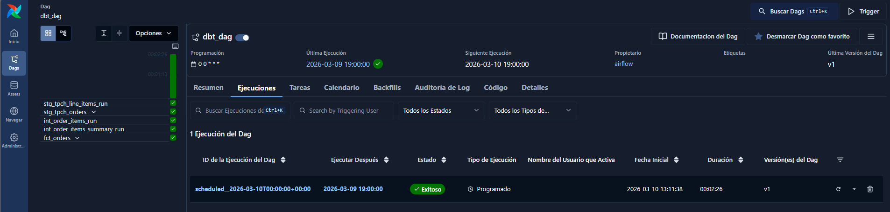
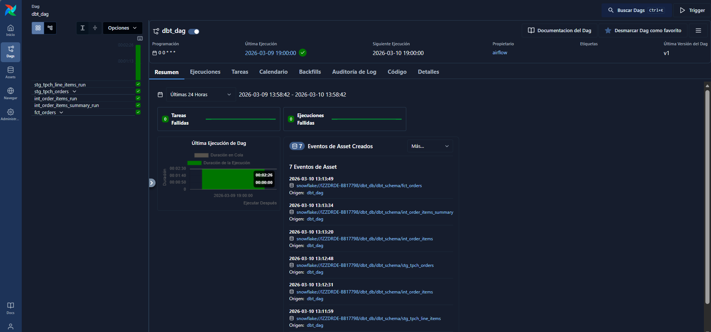
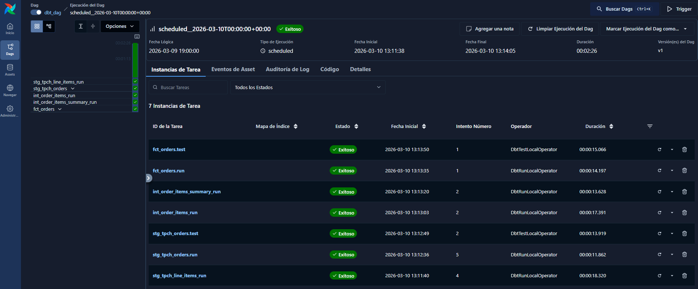

# ELT Data Pipeline with Snowflake, dbt and Airflow

This project implements an end-to-end **ELT data pipeline** using modern data stack technologies:

- Snowflake → Data Warehouse
- dbt → Data transformations and modeling
- Apache Airflow → Workflow orchestration

The pipeline extracts raw data, transforms it using dbt models, and orchestrates the execution through Airflow.

---

# Architecture

Modern ELT architecture:

Source Data → Snowflake → dbt transformations → Data Marts → Airflow orchestration

Main components:

Snowflake
- Data warehouse
- RBAC configuration
- Schemas for staging, intermediate and marts

dbt
- Data transformations
- SQL based modeling
- Testing framework
- Documentation and lineage

Airflow
- Workflow scheduling
- DAG orchestration
- Execution monitoring

---

# Project Structure


elt-dbt-snowflake-airflow-pipeline/

airflow/
│   dbt_dag.py

dbt_project/
│   dbt_project.yml

models/
│
├── staging/
├── intermediate/
└── marts/

macros/
tests/

docs/

README.md

# Snowflake Configuration

Snowflake was configured using RBAC best practices.

## Objects Created

- Warehouse
- Database
- Schemas
- Roles
- Users

Roles were granted permissions to access schemas and run transformations.

## Example Structure

```
DATABASE: ANALYTICS_DB

SCHEMAS
├── raw
├── staging
└── marts
```

---

# dbt Models

The project follows a **layered modeling architecture**.

## Staging Layer

Purpose:

- Clean raw data
- Rename fields
- Standardize data types

Example models:

```
stg_tpch_orders
stg_tpch_line_items
```

---

## Intermediate Layer

Purpose:

- Data preparation
- Aggregations
- Join logic

Example models:

```
int_order_items
int_order_items_summary
```

---

## Mart Layer

Purpose:

- Final analytics tables
- Business-ready datasets

Example model:

```
fct_orders
```

---

# dbt Tests

Two types of tests were implemented.

## Generic Tests

Used to validate common conditions:

- not_null
- unique
- accepted_values

Example:

```yaml
columns:
  - name: order_id
    tests:
      - not_null
      - unique
```

## Singular Tests

Custom SQL tests written to validate business logic.

---

# dbt Macros

Macros were implemented to reuse SQL logic across models.

Example use cases:

- Reusable transformations
- Standard calculations
- Parameterized SQL logic

---

# Airflow Orchestration

Airflow orchestrates the dbt pipeline using a **DAG (Directed Acyclic Graph)**.

## Tasks Executed

1. Run staging models  
2. Run intermediate models  
3. Run marts models  
4. Execute dbt tests  

---

# DAG Execution Example

Below is an example of a successful DAG run in Airflow.


---

# Airflow Task Execution

Each dbt model is executed as a task within the Airflow DAG.


---

# Pipeline Execution

Pipeline execution flow:

1. Airflow triggers DAG  
2. dbt executes staging models  
3. dbt executes intermediate models  
4. dbt builds fact tables  
5. dbt runs tests  
6. Results are stored in Snowflake marts  

---

# dbt Lineage Graph

dbt automatically generates a **lineage graph** showing model dependencies.

## Generate documentation

```
dbt docs generate
dbt docs serve
```

Open in browser:

```
http://localhost:8080
```

---

# Technologies Used

- Snowflake  
- dbt  
- Apache Airflow  
- SQL  
- Python  

---

# Key Concepts Implemented

- ELT pipeline architecture  
- Modern Data Stack  
- Data modeling  
- Data warehouse RBAC  
- Workflow orchestration  
- Data testing  
- Data lineage  

---

# How to Run the Project

## Install dependencies

```
pip install -r requirements.txt
```

## Run dbt models

```
dbt run
```

## Run tests

```
dbt test
```

## Start Airflow

```
airflow standalone
```

## Trigger DAG

```
dbt_dag
```

---

# Future Improvements

Possible extensions:

- Add CI/CD pipeline  
- Integrate data quality monitoring  
- Add incremental models  
- Add data visualization layer (Looker / Power BI)

---
## Pipeline Execution

### Snowflake Database Structure









